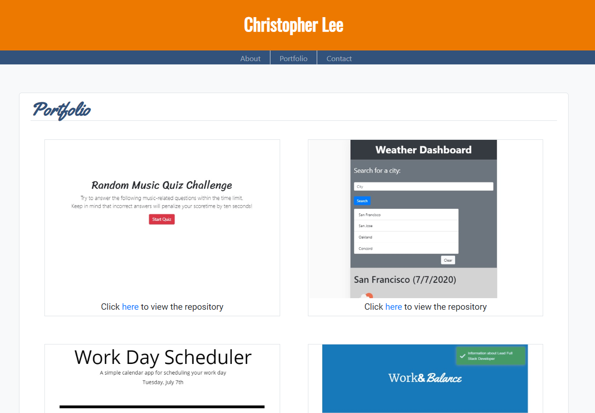

# Professional Portfolio

## Background

Having recently completed Project 1 of our intense 12-week bootcamp, this objective of this project is to update my professional portfolio page with my accomplishments so far.

Acceptance criteria is as follows:

* Updated portfolio featuring project 1 and two exemplary homework assignments. 

* Update GitHub profile with pinned repositories featuring project 1 and two exemplary assignments. 

* Updated resume

* Updated LinkedIn profile

## Site Pictures

## Links

1. [Updated Portfolio](https://cofchips.github.io/professional_materials/#)
2. [GitHub Profile](https://github.com/CofChips)
3. [Updated Resume](assets/christopherneallee_resume.pdf)
4. [Updated LinkedIn](https://www.linkedin.com/in/christophernlee/)

## Built With

* [HTML](https://developer.mozilla.org/en-US/docs/Web/HTML)
* [CSS](https://developer.mozilla.org/en-US/docs/Web/CSS)
* [Bootstrap](https://getbootstrap.com/)
* [JS](https://developer.mozilla.org/en-US/docs/Web/JavaScript)
* [jquery](https://jquery.com/)

## Deployed Link

* [See Live Site](https://cofchips.github.io/professional_materials/#)

## Authors

* **CHRISTOPHER LEE** 

- [Link to Github](https://github.com/CofChips)
- [Link to LinkedIn](https://www.linkedin.com/in/christophernlee/)

## Acknowledgments